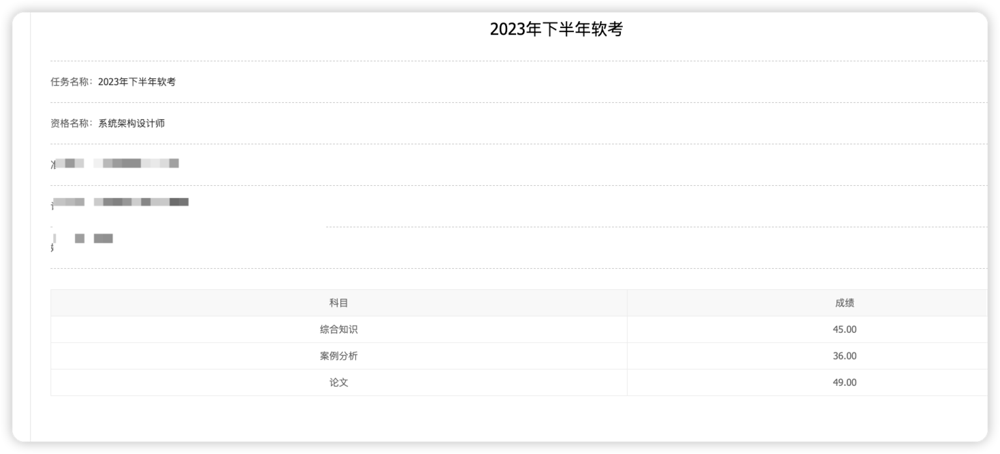

# 系统架构设计师记录

<!-- PROJECT SHIELDS -->

&nbsp;

&nbsp;

<!-- PROJECT LOGO -->

### Documentation

- ⭐️[系统架构师备考_2023文档记录](README_2023.md) 45/36/49
- ⭐️[系统架构师备考_2024文档记录](README_2024.md) 03_22开始更新

### 2023 心路历程
- 个人介绍 00年后端开发 半年B端开发经验/两年C端海外App开发经验 (Java/Python/Go)
- 所有资料都是网上收集过来的 或者本人购买的 一个月后就过期了
- 2023年系统架构设计师准备（软考高级） 一个月时间备考 11月3/4号 考试 (机考)
- 有没有浙江省杭州一起考试的同学,到时候可以一起去哦, wx: hakusai22
- 浙江工业大学屏峰校区 考试 wx: hakusai22

- 浙工大很美 下次不来了 麻辣香锅 食堂吃饭是别的同学刷的卡，不能支付宝/微信

> 分数出来了 没有过 差一点 一个月复习考架构 挑战失败 300报名费+20块网上资料+一本书《32小时通关》31块+50打车费 血亏400块

- <b>[选择题]</b> 的话 正好45分 运气挺好😄
- <b>[案例选]</b> 的1 2 3题(大数据/jwt/redis/mycat)  36分 我第一题大数据一个都没有蒙对 差一点一次性过, 大数据知识点没有复习到 要是能拿个9分我也能过 😭
- <b>[论文]</b> 选的可靠性评估(2200字 走题了 不好意思 哈哈哈 结果论文还过了分数线，我写的是公司的项目 从微服务/DB/中间件/系统稳定性写的)😆
- 太丢人了作为后端开发 案例分析没有过 
 

<!-- links -->

[your-project-path]:hakusai22/System_Architect

[contributors-shield]: https://img.shields.io/github/contributors/hakusai22/System_Architect.svg?style=for-the-badge

[contributors-url]: https://github.com/hakusai22/System_Architect/graphs/contributors

[forks-shield]: https://img.shields.io/github/forks/hakusai22/System_Architect.svg?style=for-the-badge

[forks-url]: https://github.com/hakusai22/System_Architect/network/members

[stars-shield]: https://img.shields.io/github/stars/hakusai22/System_Architect.svg?style=for-the-badge

[stars-url]: https://github.com/hakusai22/System_Architect/stargazers

[issues-shield]: https://img.shields.io/github/issues/hakusai22/System_Architect.svg?style=for-the-badge

[issues-url]: https://img.shields.io/github/issues/hakusai22/System_Architect.svg

[license-shield]: https://img.shields.io/github/license/hakusai22/System_Architect.svg?style=for-the-badge

[license-url]: https://github.com/hakusai22/System_Architect/blob/main/LICENSE

[linkedin-shield]: https://img.shields.io/badge/-LinkedIn-black.svg?style=for-the-badge&logo=linkedin&colorB=555

[linkedin-url]: https://linkedin.com/in/xxxx

