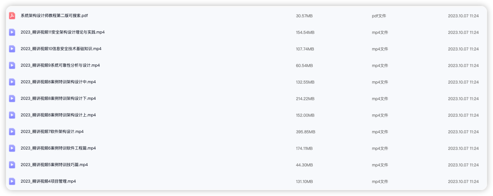
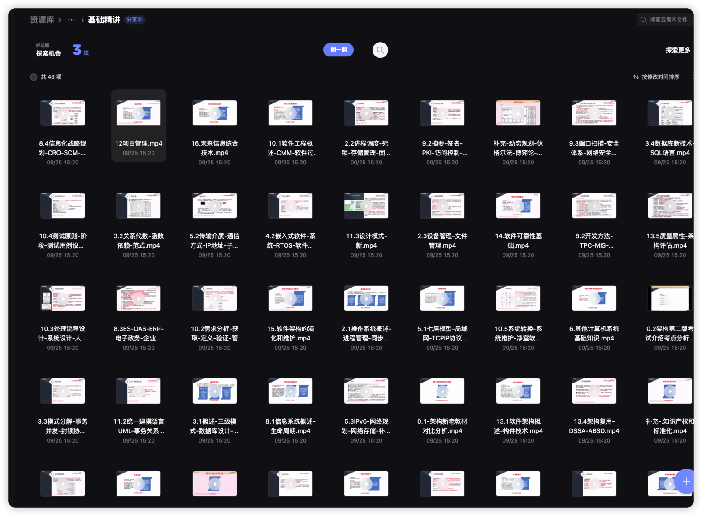

# 系统架构设计师记录

<!-- PROJECT SHIELDS -->

&nbsp;

&nbsp;

<!-- PROJECT LOGO -->

### Documentation

- ⭐️[30天系统架构师备考_2023文档记录](README_2023.md) 45/36/49
- ⭐️[20天系统架构师备考_2024文档记录](README_2024.md) 52/46/45 05_05-05/25结束考试 2024过程总结: https://juejin.cn/post/7372757076937359395

- 感谢芝士架构红宝书+App刷题 https://docs.cheko.cc/bible/system_architectural_designer_bible.html
- 300报名费+ 198芝士架构会员 总共500块 其他的就不算了

> 舒服了舒服了 😄 wx: hakusai22 可以交流经验/ 杭州e类人才交流来

### 2024 心路历程

> 选择题:

-
对比23年的题目，简单化了很多，很多基本概念的知识点，但是有些东西真的考的很广，在我所复习的资料里面没有见过，工作两年经验也没有听过这些东西，直接靠感觉走吧，45分应该没有问题吧，还有一个点非常恶心，半个小时就写完了选择题，不能提前交卷写案例架构，必须等到1个半小时才能交卷，真折磨。

> 案例分析：
>

- 第一题质量属性/微服务架构/单体架构了/性能,可修改性/(场景/刺激/环境/制品/响应/响应度量6个角度描述可用性)送分题。第二题选择的是Redis那个三个命令zadd/zrange/zrem, 分布式锁使用db唯一键存在的问题(
  答的db并发/性能，删除锁失败，无过期时间)，redis分布式锁死锁场景(答的锁删除操作问题，没考虑到set值和set过期时间不是原子性问题，吗的我以为他已经保证了，10分希望能给个面子分吧)
  /解决方案(
  答的redission/zk)。第三题选择的是一个什么矢量存储的，填空题7个前三个送分题，后面4个hdfs/hbase/es/mysql 选择很悬，基本靠猜，那些专有名词没听过，mongodb存储矢量(答的json存储)
  ，hdfs冷热存储分层(答的访问存储空间/访问速度方向) 就算第一题18分 第二题15分 第三题12分 这也有45分了吧。

> 论文：

- 垃圾电脑键盘 敲一个字卡一下，直接反馈换电脑，正好旁边人没有来考，换到他那个位置，第一个模型什么的题目都看不懂 不选，大数据lambda和kapper熟悉架构图，没有实战经验，没有去背相关论文 不选，第三题什么云部署还是什么
  不会不选，最后一个 单元测试，额写过很多，但是要写出一篇论文来，真的是无语了，没办法只能硬着头皮写这个题目了，摘要都写了20分钟了，题目里面说的静态测试/动态测试/回归测试
  全都理解错了，真无语死了，写完摘要突然想到去年服务器开发开框架重构，使用mybatis-plus重构ormlite，期间测试起来困难，还出现了事故，单元测试覆盖率要去90%以上 使用jacoco
  github.com/jacoco/jaco…
  这个开源框架，觉得这个案例更加贴切单元测试题目，就一个打口水战，又把摘要重写了一遍，写完发现时间都不够了，后面一直写到结束2100个字，练检查的时间都没有，全是口水文字，看命了，就这样吧，没想到最后45分 在过的分数范围内。

 

### 2023 心路历程

- 个人介绍 00年后端开发 半年B端开发经验/两年C端海外App开发经验 (Java/Python/Go)
- 所有资料都是网上收集过来的 或者本人购买的 一个月后就过期了
- 2023年系统架构设计师准备（软考高级） 一个月时间备考 11月3/4号 考试 (机考)
- 有没有浙江省杭州一起考试的同学,到时候可以一起去哦
- 浙江工业大学屏峰校区 考试

- 浙工大很美 下次不来了 麻辣香锅 食堂吃饭是别的同学刷的卡，不能支付宝/微信

> 分数出来了 没有过 差一点 一个月复习考架构 挑战失败 300报名费+20块网上资料+一本书《32小时通关》31块+50打车费 血亏400块

- <b>[选择题]</b> 的话 正好45分 运气挺好😄
- <b>[案例选]</b> 的1 2 3题(大数据/jwt/redis/mycat)  36分 我第一题大数据一个都没有蒙对 差一点一次性过, 大数据知识点没有复习到 要是能拿个9分我也能过 😭
- <b>[论文]</b> 选的可靠性评估(2200字 走题了 不好意思 哈哈哈 结果论文还过了分数线，我写的是公司的项目 从微服务/DB/中间件/系统稳定性写的)😆
- 太丢人了作为后端开发 案例分析没有过
  

> 文老师视频

2023年系统架构设计师视频
https://www.alipan.com/s/a8ji1cZogJZ
点击链接保存，或者复制本段内容，打开「阿里云盘」APP ，无需下载极速在线查看，视频原画倍速播放。

> 希赛视频

2023 知识点详情解析
链接：https://pan.baidu.com/s/1VQhuB_Yh9kczGVBzNWVjXA
提取码：95km
复制这段内容打开「百度网盘APP 即可获取

<!-- links -->

> 2024 总结
https://juejin.cn/post/7372757076937359395

[your-project-path]:hakusai22/System_Architect

[contributors-shield]: https://img.shields.io/github/contributors/hakusai22/System_Architect.svg?style=for-the-badge

[contributors-url]: https://github.com/hakusai22/System_Architect/graphs/contributors

[forks-shield]: https://img.shields.io/github/forks/hakusai22/System_Architect.svg?style=for-the-badge

[forks-url]: https://github.com/hakusai22/System_Architect/network/members

[stars-shield]: https://img.shields.io/github/stars/hakusai22/System_Architect.svg?style=for-the-badge

[stars-url]: https://github.com/hakusai22/System_Architect/stargazers

[issues-shield]: https://img.shields.io/github/issues/hakusai22/System_Architect.svg?style=for-the-badge

[issues-url]: https://img.shields.io/github/issues/hakusai22/System_Architect.svg

[license-shield]: https://img.shields.io/github/license/hakusai22/System_Architect.svg?style=for-the-badge

[license-url]: https://github.com/hakusai22/System_Architect/blob/main/LICENSE

[linkedin-shield]: https://img.shields.io/badge/-LinkedIn-black.svg?style=for-the-badge&logo=linkedin&colorB=555

[linkedin-url]: https://linkedin.com/in/xxxx

## star 趋势图

