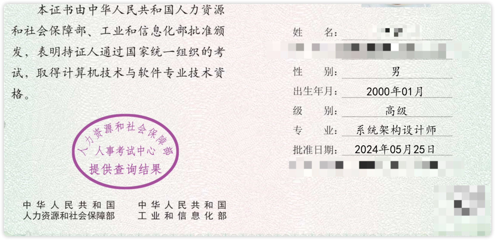

# System_Architect
2023年系统架构设计师准备（软考高级） 一个月时间备考 11月3/4号 考试 (机考)

<!-- PROJECT SHIELDS -->

[![Contributors][contributors-shield]][contributors-url]
[![Forks][forks-shield]][forks-url]
[![Stargazers][stars-shield]][stars-url]
[![MIT License][license-shield]][license-url]

<!-- PROJECT LOGO -->
 

    
    <h3 align="center">2023年系统架构设计师准备（软考高级） 🔞</h3>
  

    ·
    <a href="https://github.com/hakusai22/System_Architect/issues">报告Bug</a>
    ·
    <a href="https://github.com/hakusai22/System_Architect/issues">提出新特性</a>
  

<!-- links -->

[your-project-path]:hakusai22/System_Architect

[contributors-shield]: https://img.shields.io/github/contributors/hakusai22/System_Architect.svg?style=for-the-badge

[contributors-url]: https://github.com/hakusai22/System_Architect/graphs/contributors

[forks-shield]: https://img.shields.io/github/forks/hakusai22/System_Architect.svg?style=for-the-badge

[forks-url]: https://github.com/hakusai22/System_Architect/network/members

[stars-shield]: https://img.shields.io/github/stars/hakusai22/System_Architect.svg?style=for-the-badge

[stars-url]: https://github.com/hakusai22/System_Architect/stargazers

[issues-shield]: https://img.shields.io/github/issues/hakusai22/System_Architect.svg?style=for-the-badge

[issues-url]: https://img.shields.io/github/issues/hakusai22/System_Architect.svg

[license-shield]: https://img.shields.io/github/license/hakusai22/System_Architect.svg?style=for-the-badge

[license-url]: https://github.com/hakusai22/System_Architect/blob/master/LICENSE

[linkedin-shield]: https://img.shields.io/badge/-LinkedIn-black.svg?style=for-the-badge&logo=linkedin&colorB=555

[linkedin-url]: https://linkedin.com/in/xxxx

## 手机App刷题--软考通 免费

## 1. 视频资料复习 (30天到期)
- 
- 链接: https://pan.baidu.com/s/1wdLPmv5td6F4R99vjjkX6g 
- 提取码: 95tp

## 2. 视频资料复习 (30天到期)
- 
- 
- 2023年系统架构设计师视频 
- https://www.aliyundrive.com/s/fe4qxWFk5u5
- 系统架构设计师备考资料 链接：https://www.aliyundrive.com/s/ob1o2BeaVMb 提取码: 4v3y

## 3. 知识点网站阅读复习
- [基本知识点笔记](https://lisahust.github.io/notebook1_web/)

## 4. B站免费视频知识点讲解复习 
- [软考高级系统架构设计师视频教程录播直播资料真题课程案例论文文老师软考教育](https://www.bilibili.com/video/BV1YV411Y7t4/?spm_id_from=333.999.0.0&vd_source=5c4d3e12d3512ed84532d27dcef8ab0d)
- [系统架构设计师](https://www.bilibili.com/video/BV1wD4y1q7ni/?spm_id_from=333.337.search-card.all.click&vd_source=5c4d3e12d3512ed84532d27dcef8ab0d)
- [软考系统架构设计师教程精讲视频](https://www.bilibili.com/video/BV1Ak4y1s7Hd/?spm_id_from=333.337.search-card.all.click&vd_source=5c4d3e12d3512ed84532d27dcef8ab0d)

## 5. 相关知识点网站的资料复习
- [CSDN 基本知识点总结](https://blog.csdn.net/weixin_30197685/article/details/132797803?app_version=6.1.4&utm_source=app)
- [系统架构设计师新版教程解读公开课](https://wangxiao.xisaiwang.com/shipin2/v280007661.html)
- [复习七天通过软考高级系统架构师](https://zhuanlan.zhihu.com/p/338502562)
- [博客园系统架构师知识点总结](https://www.cnblogs.com/Tiancheng-Duan/tag/%E6%9E%B6%E6%9E%84/)
- [软考高级系统架构师论文到底该怎么写](https://mp.weixin.qq.com/s/E97YA-VktIoEmOCwZ2EUqg)