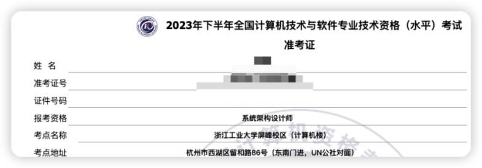
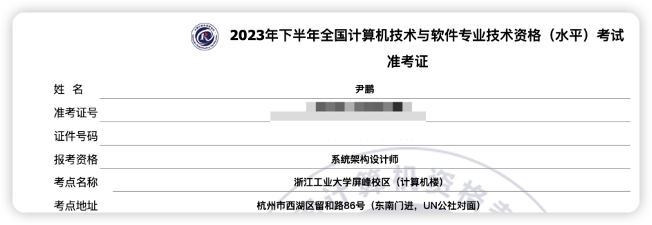
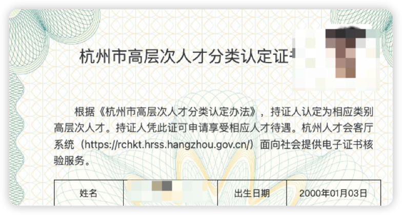
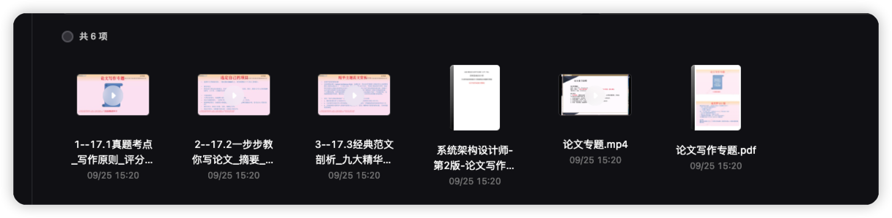
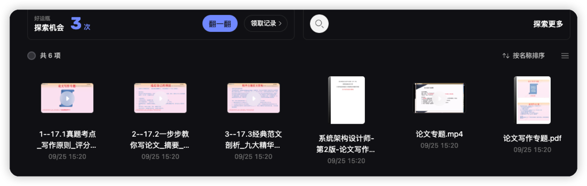

# 2023年系统架构设计师准备（软考高级）

- 
- 
- 
- 
- 

- 

<h3> 芜湖 下午买的车就到了 </h3>

- 

<!-- PROJECT SHIELDS -->

[![Contributors][contributors-shield]][contributors-url]
[![Forks][forks-shield]][forks-url]
[![Stargazers][stars-shield]][stars-url]
[![MIT License][license-shield]][license-url]

<!-- PROJECT LOGO -->
 

    
    <h3 align="center">2023年系统架构设计师准备（软考高级） 🔞</h3>
  

    ·
    <a href="https://github.com/hakusai22/System_Architect/issues">报告Bug</a>
    ·
    <a href="https://github.com/hakusai22/System_Architect/issues">提出新特性</a>
  

<!-- links -->

[your-project-path]:hakusai22/System_Architect

[contributors-shield]: https://img.shields.io/github/contributors/hakusai22/System_Architect.svg?style=for-the-badge

[contributors-url]: https://github.com/hakusai22/System_Architect/graphs/contributors

[forks-shield]: https://img.shields.io/github/forks/hakusai22/System_Architect.svg?style=for-the-badge

[forks-url]: https://github.com/hakusai22/System_Architect/network/members

[stars-shield]: https://img.shields.io/github/stars/hakusai22/System_Architect.svg?style=for-the-badge

[stars-url]: https://github.com/hakusai22/System_Architect/stargazers

[issues-shield]: https://img.shields.io/github/issues/hakusai22/System_Architect.svg?style=for-the-badge

[issues-url]: https://img.shields.io/github/issues/hakusai22/System_Architect.svg

[license-shield]: https://img.shields.io/github/license/hakusai22/System_Architect.svg?style=for-the-badge

[license-url]: https://github.com/hakusai22/System_Architect/blob/master/LICENSE

[linkedin-shield]: https://img.shields.io/badge/-LinkedIn-black.svg?style=for-the-badge&logo=linkedin&colorB=555

[linkedin-url]: https://linkedin.com/in/xxxx

### 手机App刷题--软考通 免费  芝士架构 免费(芝士架构微信群还是有很多活跃的小伙伴 一起交流 押题) (wx群被解散了)

> 买了本书没事看看

## 1. 视频资料复习 (30天到期)

- 
- 链接: https://pan.baidu.com/s/1wdLPmv5td6F4R99vjjkX6g  提取码: 95tp

## 2. 视频资料复习 (30天到期)

- 
- 
- 2023年系统架构设计师视频  https://www.aliyundrive.com/s/fe4qxWFk5u5
- 2023年系统架构设计师备考资料 链接：https://www.aliyundrive.com/s/ob1o2BeaVMb 提取码: 4v3y
- 系统架构设计师 百度网盘：链接: https://pan.baidu.com/s/19LEiYbYIwnhBqheOiemOzg 密码:ghjh

## 3. 知识点网站阅读复习

- [基本知识点笔记](https://lisahust.github.io/notebook1_web/)
- [系统架构设计师历年真题含答案与解析历年真题](https://ebook.qicoder.com/%E7%B3%BB%E7%BB%9F%E6%9E%B6%E6%9E%84%E8%AE%BE%E8%AE%A1%E5%B8%88/)

## 4. B站免费视频知识点讲解复习

- [软考高级系统架构设计师视频教程录播直播资料真题课程案例论文文老师软考教育](https://www.bilibili.com/video/BV1YV411Y7t4/?spm_id_from=333.999.0.0&vd_source=5c4d3e12d3512ed84532d27dcef8ab0d)
- [系统架构设计师](https://www.bilibili.com/video/BV1wD4y1q7ni/?spm_id_from=333.337.search-card.all.click&vd_source=5c4d3e12d3512ed84532d27dcef8ab0d)
- [软考系统架构设计师教程精讲视频](https://www.bilibili.com/video/BV1Ak4y1s7Hd/?spm_id_from=333.337.search-card.all.click&vd_source=5c4d3e12d3512ed84532d27dcef8ab0d)

## 5. 相关知识点网站的资料复习

- [CSDN 基本知识点总结](https://blog.csdn.net/weixin_30197685/article/details/132797803?app_version=6.1.4&utm_source=app)
- [系统架构设计师新版教程解读公开课](https://wangxiao.xisaiwang.com/shipin2/v280007661.html)
- [复习七天通过软考高级系统架构师](https://zhuanlan.zhihu.com/p/338502562)
- [博客园系统架构师知识点总结](https://www.cnblogs.com/Tiancheng-Duan/tag/%E6%9E%B6%E6%9E%84/)
- [软考高级系统架构师论文到底该怎么写](https://mp.weixin.qq.com/s/E97YA-VktIoEmOCwZ2EUqg)

## 个人复习记录表

### 10月12号 案例/论文复习

- 看了文老师讲案例视频 两节
- https://mafgwo.cn/2022/06/09/1215_jiagouanlitaolu-other/ 可靠性与安全设计案例分析
- https://mafgwo.cn/2022/06/08/1214_jiagouanlitaolu-database/  数据库案例分析
- https://mafgwo.cn/2022/06/07/1211_jiagouanlitaolu-ruanjiangongcheng/ 软件工程案例分析
- https://mafgwo.cn/2022/08/28/1218_jiagoulunwen-self/ 架构评估方法
- https://mafgwo.cn/2022/06/16/1216_jiagoulunwentaolu/ 系统架构设计师论文套路
- https://mafgwo.cn/2022/08/28/1218_jiagoulunwen-self/ 同一个项目背景不同主题三篇及格论文

### 10月13号 选择题/案例/论文复习

- 刷 软考app选择题
- 看 案例分析/案例必背.docx
- 看 2020年下午案例 (架构风格(管道/仓库必背知识点)+关系型数据库(表的设计/超类实体/派生属性)
  +Redis+Web系统架构) https://ebook.qicoder.com/%E7%B3%BB%E7%BB%9F%E6%9E%B6%E6%9E%84%E8%AE%BE%E8%AE%A1%E5%B8%88/notes/2020%E6%9E%B6%E6%9E%84%E4%B8%8B%E5%8D%88%E6%A1%88%E4%BE%8B%E9%A2%98.html
- 看 2019年下午案例 (架构风格[独立构件风格(基于规则/面向对象)]
  +数据流图+分布式数据库+web系统架构) https://ebook.qicoder.com/%E7%B3%BB%E7%BB%9F%E6%9E%B6%E6%9E%84%E8%AE%BE%E8%AE%A1%E5%B8%88/notes/2019%E5%B9%B4%E6%9E%B6%E6%9E%84%E4%B8%8B%E5%8D%88%E9%A2%98.html
- 《一张图辅助记忆软件架构风格》https://juejin.cn/post/7142871629767376903 https://juejin.cn/post/7144764151955456014
- 《知识产权与标准化》https://juejin.cn/post/7142122434685042725
- 《论文复习大纲和模板》https://juejin.cn/post/7130260243958726664

### 10月14号 休息

### 10月15号
- [系统架构设计师论文](https://blog.csdn.net/sinat_31152963/category_10672942.html)
- [软考高级系统架构师论文到底该怎么写](https://mp.weixin.qq.com/s/E97YA-VktIoEmOCwZ2EUqg)
- [希赛官方的真题集锦](https://www.educity.cn/rk/zhenti/jiagou/)
- [公开真题吧](https://www.gkzenti.cn/paper?cls=%E8%BD%AF%E8%80%83&province=%E9%AB%98%E7%BA%A7_%E7%B3%BB%E7%BB%9F%E6%9E%B6%E6%9E%84%E8%AE%BE%E8%AE%A1%E5%B8%88)
- 系统架构设计师 百度网盘：链接: https://pan.baidu.com/s/19LEiYbYIwnhBqheOiemOzg 密码:ghjh

### 10月16号 案例分析
- 看案例必背知识点
    - 软件架构设计
        - 架构风格 五大
            - (数据流/仓库/调用返回/独立构件/虚拟机) [一张图快速了解五大架构风格](https://zhuanlan.zhihu.com/p/429046857)
        - 典型层次架构 (mvc/mvp) [MVC MVP MVVM Redux 架构介绍](https://zhuanlan.zhihu.com/p/59814282)
        - 面向服务的架构 [面向服务的架构（SOA）它的优点是什么，可应用于哪些领域](https://www.zhihu.com/question/450799639/answer/1800986029)
            - SOA 面向服务的架构 一种概念和思想 [如何理解SOA,SOAP,RPC, REST 协议及其之间的关系](https://zhuanlan.zhihu.com/p/489185800)
                - UDDI 统一描述发现集成 (类似服务注册中心)
                - WSDL 面向服务描述语言 (服务之间通信的协议语言)
                - SOAP 简单对象访问协议 (基于任何传输协议，TCP,HTTP,SMTP,MSMQ)
                - REST 表征状态转移 HTTP 方法 (GET/PUT/POST/DELETE)
                - BPEL 面向Web服务流程处理语言
            - SOA 技术实现
                - Web服务
                - 企业总线 ESB [ESB - 企业服务总线](https://zhuanlan.zhihu.com/p/604648356)
            - 微服务
                - 微服务和SOA区别
        - [软件架构评估](https://zhuanlan.zhihu.com/p/564144022)
            - 软件质量属性 8个  [系统架构设计师-软件质量属性](https://zhuanlan.zhihu.com/p/405478863)
                - 性能 系统的响应能力
                - 可靠性
                - 可用性
                - 安全性
                - 可修改性
                - 功能性
                - 可变性
                - 互操作性
            - 架构风险
            - 敏感点
                - 敏感点是指为了实现某种特定的质量属性，一个或多个构件所具有的特性。
            - 权衡点
                - 权衡点是影响多个质量属性的特性，是多个质量属性的敏感点。
            - 风险点、非风险点
                - 系统架构风险是指架构设计中潜在的存在问题，架构决策所带来的隐患。
            - 软件架构分析法 SAAM
            - 架构权衡分析法 ATAM
    - 数据库
        - redis和memcached比较 [Memcached VS Redis](https://zhuanlan.zhihu.com/p/355330970)
        - 数据库读写分离
            - 主从复制
            - 数据库拆分
                - 水平/垂直
            - 反规范化
                - 增加冗余列/派生列/重新组表/水平分割表/垂直分割表
    - 系统安全
        - 对称加密/非对称加密/数据库加解密
    - 设计模式
    - 系统需求分析
        - DFD 数据流图
            - 数据流：箭头。外部实体：矩形。加工：圆角矩形。数据存储：右侧开放矩形
        - UML [UML建模都有那些图](https://zhuanlan.zhihu.com/p/540136307)
            - 类图
                - 类之间的关系包括：关联、聚合、组合、依赖、泛化
            - 用例图
        - ER图
    - 系统的可靠性分析与设计
    - 项目管理

### 10月17号 案例分析
- 案例分析知识点汇总

### 10月18号
- 23年系统架构设计师考前20问.docx
- 2023年11月架构设计师重要知识点100条.pdf
- https://developer.aliyun.com/article/885770

### 10月19号
- [软考机考系统操作指南](https://www.bilibili.com/video/BV12Q4y1s7n3/?spm_id_from=333.337.search-card.all.click&vd_source=5c4d3e12d3512ed84532d27dcef8ab0d)

### 10月20号
- 系统架构设计师考试笔记.pdf
- 23年架构师易混淆知识点精简版.docx
- 23年架构师考前几页纸.docx
- 23年系统架构师论文模板（水印版）(2).docx
- 2023年11月系统架构设计师易混淆知识点.pdf
- 23年软考架构设计师《知识点集锦》备考精华(1)(1).docx
- 23年系统架构设计师考前20问.docx

### 10月21号
- 23年架构师考前几页纸.docx
- [13.1视频](软件架构概述)
- [13.2视频](软件架构风格)

## 10月23号 休息

## 10月24号

- [x] 补视频 基础精讲 (软件工程/软件架构/数据库设计)
  

## 10月25号

- [x] 资料复习
    - 系统架构设计师考前背诵.docx

- [ ] 软考通手机刷真题/背真题
    - 2022年上午真题
    - 2021年上午真题
    - 2020年上午真题
    - 2019年上午真题
- [ ] 论文视频刷完
  

- (McCabe度量方法计算程序复杂度)[https://blog.csdn.net/qq_43448856/article/details/123520356]

## 10月26号 休息
## 10月27号 休息
## 10月28号 休息
## 10月29号 休息
## 10月30号 星期一

- 看完论文视频 干到凌晨2点
- 
- 根据自己项目写出一些通用模版 https://www.yuque.com/hakusai/gkr7pp/ob7v3l1dp0cyyb8g
- 看完基础案例知识点 进行截图总结 https://www.yuque.com/hakusai/gkr7pp/ui5px2okz3x272so

## 10月31号 星期二

- 案例 信息系统 层次架构 云原生 面向服务soa 微服务 https://www.yuque.com/hakusai/gkr7pp/ui5px2okz3x272so
- 知识产权 https://www.yuque.com/hakusai/gkr7pp/pz9xgk493mn94rmx
- 软件架构风格 质量属性 https://www.yuque.com/hakusai/gkr7pp/pz9xgk493mn94rmx
- 软件工程 https://www.yuque.com/hakusai/gkr7pp/pz9xgk493mn94rmx#qacpD

## 11月1号 星期三 休息

## 11月3号 星期五 最后一天

- 论文结构分析.png
- 系统架构设计师论文（模板）.pdf
- 例文－论软件架构的选择.docx
- 例文－论软件系统架构评估.docx
- 万能模板 论文必须要记住的.doc
- 系统架构设计师2013-2018论文解析.docx
- 例文－论高可靠性系统中软件容错技术的应用.docx
- 企业集成平台.docx
- 案例必背.docx
- 案例分析知识点汇总.docx
- 系统架构设计师部分计算题解析.docx
- 系统架构设计师考前背诵.docx
- 系统架构设计师部分计算题解析.docx
- 系统架构设计师考前几页纸.pdf
- 2023年11月系统架构设计师论文范文十篇.docx
- 2023年11月系统架构设计师易混淆知识点.pdf
- 23年架构师考前几页纸.docx
- 23年系统架构师论文模板（水印版_20.docx
- 2023年11月架构设计师重要知识点100条.pdf
- 23年软考架构设计师《知识点集锦》备考精华_20.docx

<h1>考完了 结束</h1>