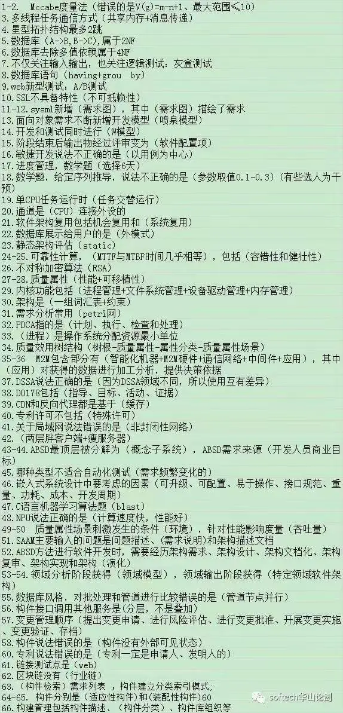
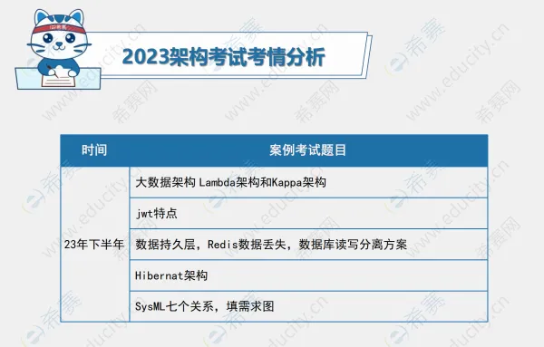
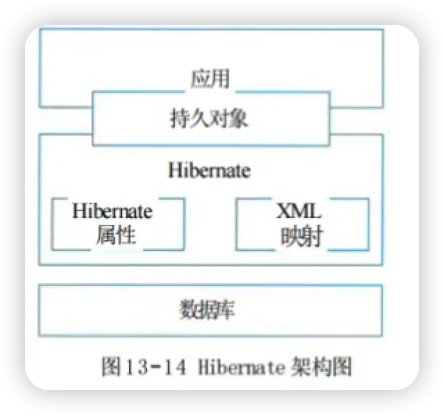
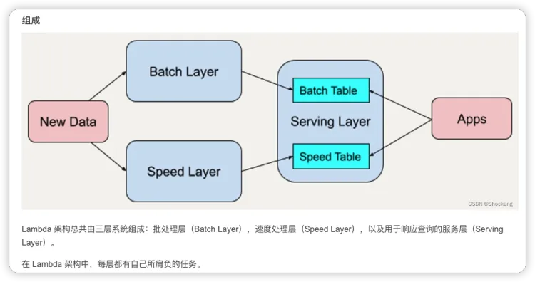
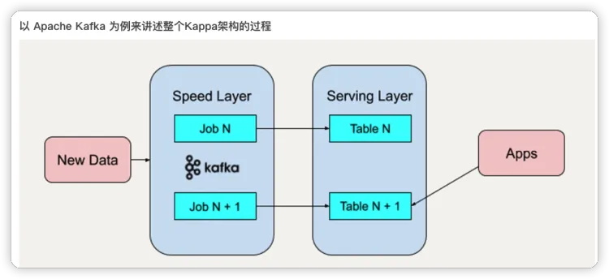
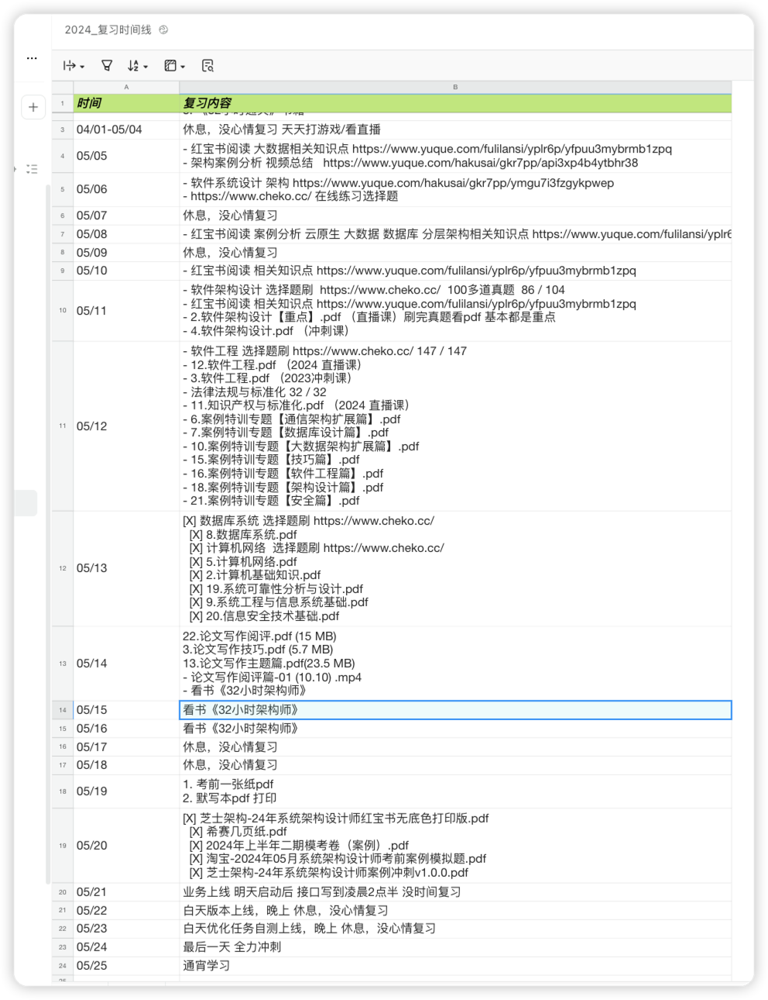

# # 2024年系统架构设计师备考（软考高级）

> 03/22 报名通过 缴费完成

> 去年11月份 考的知识点 先回想一下哪些事没有写出来的，哪些是写错的，进行总结一下。

> 选择题 太宽泛 正好45分 全靠运气

> 案例分析题 36分 案例知识点还是复习的不够宽泛。

- 大数据架构 Lambda架构和Kappa架构 25分 （我选择）
    - 没看过 全靠蒙
- jwt特点 数据持久层orm Hibernat架构 25分 （我选择）
    - jwt 组成header playload signature组成，我写错了 （密码 加密算法 盐值），Hibernat填空题 好像对了一个，
- Redis数据一致性，数据库读写分离方案 25分 （我选择）
    - redis一致性(最终一致性和强一致性) 数据库读写分离
- SysML七个关系，填需求图 （不会）

> 下面的架构图都没见过，最近在书上翻了一翻，还真的找到了 看来要精读那本32小时书籍了。案例要是看了这几张图 就稳了

> 论文

- 试题一、论面向对象设计的应用与实现
- 试题二、论多数据源集成的应用与实现,
  - 可以写ETL，数据集成，数据仓库，湖仓一体相关的知识
- 试题三、论软件可靠性评价的设计与实现 （我选择）
- 试题四、论边云协同的设计与实现

## 05/05 倒计时20天 开始复习

- https://www.yuque.com/hakusai/gkr7pp/ych63iezwofm2yli#4qPz
  

> 选择题:

-
对比23年的题目，简单化了很多，很多基本概念的知识点，但是有些东西真的考的很广，在我所复习的资料里面没有见过，工作两年经验也没有听过这些东西，直接靠感觉走吧，45分应该没有问题吧，还有一个点非常恶心，半个小时就写完了选择题，不能提前交卷写案例架构，必须等到1个半小时才能交卷，真折磨。

> 案例分析：

- 第一题质量属性/微服务架构/单体架构了/性能,可修改性/(场景/刺激/环境/制品/响应/响应度量6个角度描述可用性)
  送分题。第二题选择的是Redis那个三个命令zadd/zrange/zrem, 分布式锁使用db唯一键存在的问题(
  答的db并发/性能，删除锁失败，无过期时间)，redis分布式锁死锁场景(
  答的锁删除操作问题，没考虑到set值和set过期时间不是原子性问题，吗的我以为他已经保证了，10分希望能给个面子分吧)
  /解决方案(
  答的redission/zk)。第三题选择的是一个什么矢量存储的，填空题7个前三个送分题，后面4个hdfs/hbase/es/mysql
  选择很悬，基本靠猜，那些专有名词没听过，mongodb存储矢量(答的json存储)
  ，hdfs冷热存储分层(答的访问存储空间/访问速度方向) 就算第一题18分 第二题15分 第三题12分 这也有45分了吧。

> 论文：

- 垃圾电脑键盘 敲一个字卡一下，直接反馈换电脑，正好旁边人没有来考，换到他那个位置，第一个模型什么的题目都看不懂
  不选，大数据lambda和kapper熟悉架构图，没有实战经验，没有去背相关论文 不选，第三题什么云部署还是什么
  不会不选，最后一个 单元测试，额写过很多，但是要写出一篇论文来，真的是无语了，没办法只能硬着头皮写这个题目了，摘要都写了20分钟了，题目里面说的静态测试/动态测试/回归测试
  全都理解错了，真无语死了，写完摘要突然想到去年服务器开发开框架重构，使用mybatis-plus重构ormlite，期间测试起来困难，还出现了事故，单元测试覆盖率要去90%以上
  使用jacoco
  github.com/jacoco/jaco…
  这个开源框架，觉得这个案例更加贴切单元测试题目，就一个打口水战，又把摘要重写了一遍，写完发现时间都不够了，后面一直写到结束2100个字，练检查的时间都没有，全是口水文字，看命了，就这样吧，没想到最后45分
  在过的分数范围内。
